# User Guide

[Introduction](#introduction)

[Setup environments](#setup-environments)

[Step 1: GridDB server setup](#step-1-griddb-server-setup)

[Step 2: GridDB server data](#step-2-griddb-server-data)

[Step 3: GridDB Plugin setup](#step-3-griddb-plugin-setup)

[How to use](#how-to-use)

[Adding the data source](#adding-the-data-source)

[Create variable](#create-variable)

[Create annotation](#create-annotation)

[Create query to draw Graph](#create-query-to-draw-graph)

[Create query with Explore](#create-query-with-Explore)

[Appendix](#appendix)

[Query special expression](#query-special-expression)

# Introduction

This Plugin will be used to get data from GridDB database and display as graph or table base on Grafana platform.

# Setup environments

OS for this user guide is CentOS 7.6

### Step 1: GridDB server setup

+ Setup GridDB NoSQL V4.2 by following guide: <https://github.com/griddb/griddb_nosql> (in this guide, set **clusterName** as "cluster_example")

+ Setup WebAPI V2.0 by following guide: <https://github.com/griddb/webapi> 

### Step 2: GridDB server data
Insert data to 3 containers with schema as below (or using sample data creation tool on <https://github.com/griddb/griddb-datasource/blob/master/sample/SampleData>)

+ Container 1:

  + Container name: one_thousand_rows

  + Container type: TIME_SERIES

  + Container schema:

        | Name    	| Type      	| Constraints 	|
        |---------	|-----------	|-------------	|
        | time    	| TIMESTAMP 	| NOT NULL    	|
        | column1 	| INTEGER   	|             	|
        | column2 	| INTEGER   	|             	|
        | column3 	| INTEGER   	|             	|
        | column4 	| INTEGER   	|             	|
        | column5 	| INTEGER   	|             	|

+ Container 2:

  + Container name: Multiple_Time_Columns

  + Container type: COLLECTION

  + Container schema:

        | Name    	| Type      	| Constraints 	|
        |---------	|-----------	|-------------	|
        | time_1  	| TIMESTAMP 	| NOT NULL    	|
        | time_2  	| TIMESTAMP 	|             	|
        | column1 	| STRING    	|             	|
        | column2 	| INTEGER   	|             	|

+ Container 3:

  + Container name: Multiple_Type

  + Container type: TIME_SERIES

  + Container schema:

        | Name    	| Type      	| Constraints 	|
        |---------	|-----------	|-------------	|
        | time    	| TIMESTAMP 	| NOT NULL    	|
        | column1 	| INTEGER   	|             	|
        | column2 	| STRING    	|             	|
        | column3 	| BOOL      	|             	|
        | column4 	| DOUBLE    	|             	|
        | column5 	| FLOAT     	|             	|

### Step 3: GridDB Plugin setup

1. Go to $GRAFANA_HOME/data/plugins, create a new folder "GridDB-plugin"
    + Note: This folder is created after run Grafana server the first time.
2. Copy folder "dist" to folder "GridDB-plugin"
3. Restart your Grafana server 

Note: The folder "dist" includes files created by building with the following method.

    Precondition: npm is installed

    Go to source include file package.json and run the command below:

        $ npm install -g yarn
        $ yarn install
        $ yarn build

# How to use

## Adding the data source

**Step 1**: In the side menu select **Configuration**>**Data Sources**

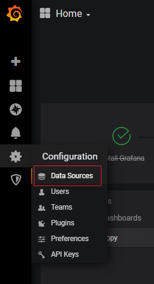

<span id="_Toc535842076" class="anchor" text-align="center"></span>Figure 1: Select Data Sources

**Step 2**: Click the **Add data source** button 

**Step 3**: Select **GridDB** from data source list

**Step 4**: Input valid value as example figure below

**Step 5**: Click **Save & Test** button to check the connection to datasource. System uses basic authentication to authenticate to GridDB server

> <i>Note: Check appendix about $\_minInterval for Min time interval input.</i>

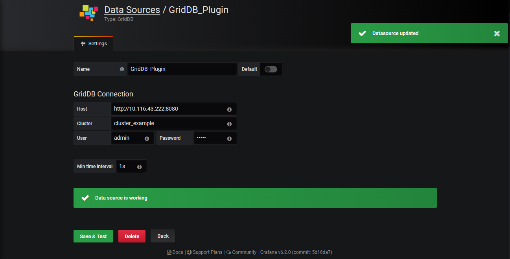

<span id="_Toc535842076" class="anchor" text-align="center"></span>Figure 2: Datasource when connecting to GridDB server successfully


## Create Variable
**Step 1**: Open a Dashboard

**Step 2**: Click to the dashboard **Settings** button on the top screen

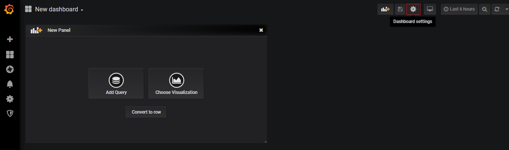

<span id="_Toc535842076" class="anchor" text-align="center"></span>Figure 3: Select Dashboard Settings

**Step 3**: In the side menu under the **Settings** and select **Variables**

**Step 4**: Click the **Add variable** button in the center screen

**Step 5**: Input data for variable screen. User may be use one of three formats below to create variable:

1. To get all containers

```bash
$griddb_container_list
```

2. To get all columns of a specific container

```bash
$griddb_column_list({container name})
```

3. To get data of a specific container

```bash
$griddb_query_data({container name}, {columns}, {TQL})
```

**Step 6**: Focus to other field to show preview data of variable

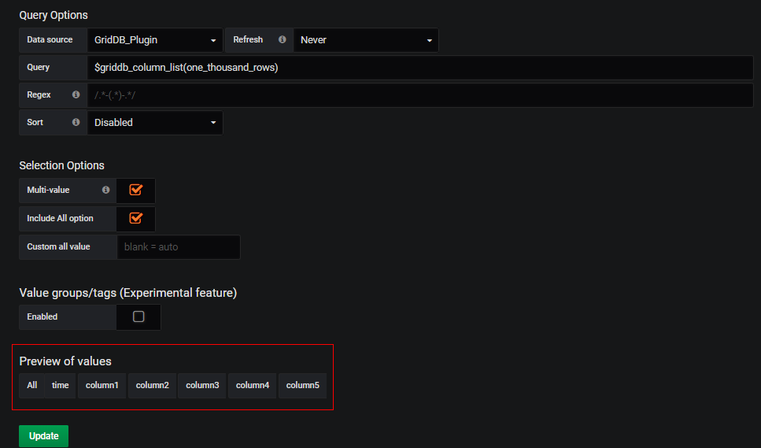

<span id="_Toc535842078" class="anchor"></span>Figure 4: Preview value of the variable


**Step 7**. Click **Add/Update** and select **Save As** then click **Save** button in confirm popup to save new a variable

After creating variable successfully, variable will be displayed on the query data screen


<span id="_Toc535842079" class="anchor"></span>Figure 5: All variables display on the query data screen

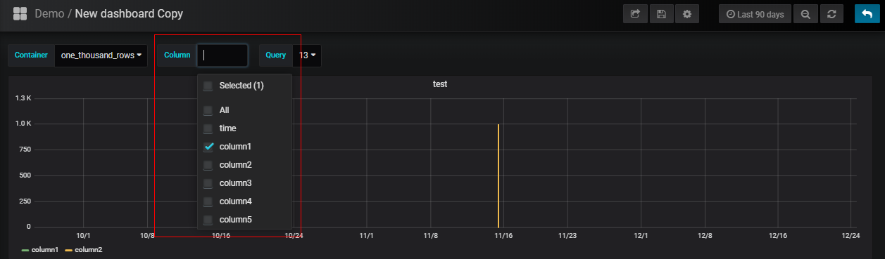

<span id="_Toc535842080" class="anchor"></span>Figure 6: Options for the specific variables

Variable automatic added into container list box

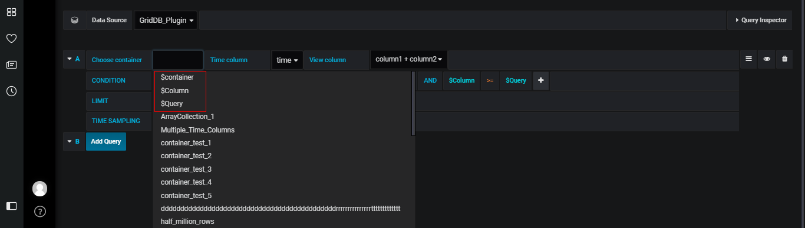

<span id="_Toc535842081" class="anchor"></span>Figure 7: Variables is displayed on the container list select box

**Step 8**: Use variable in Select box mode

Choose **$container** from container select box

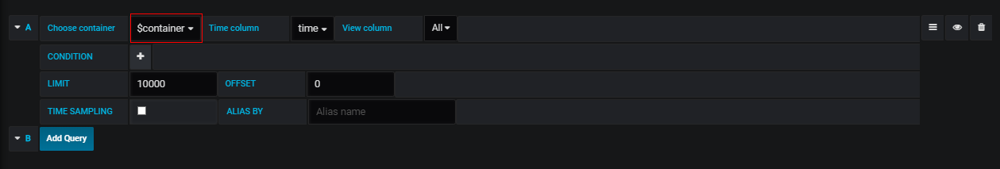

<span id="_Toc535842082" class="anchor"></span>Figure 8: Use variable from Container select box

Select container “one\_thousand\_rows” from **$container**. Grafana will be auto replace $container by selected container

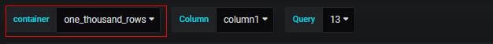

<span id="_Toc535842083" class="anchor"></span>Figure 9: Select container “one\_thousand\_rows”

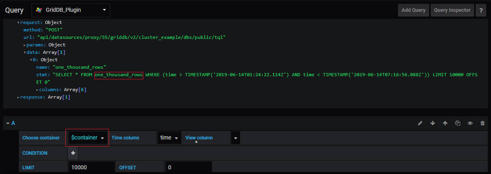

<span id="_Toc535842084" class="anchor"></span>Figure 10: When the variable is changed, query auto executed with the selected container

## Create annotation

**Step 1**: Open a dashboard and click to the **Settings** button on the top screen.

**Step 2**: In the side menu select **Settings**>**Annotations**

**Step 3**: Click the **Add Annotation Query** button in the center screen.

**Step 4**: Currently, GridDB plugin is supporting two annotation types are **normal annotation** and **regions annotation**. The first, let input data below to create a **normal annotation**

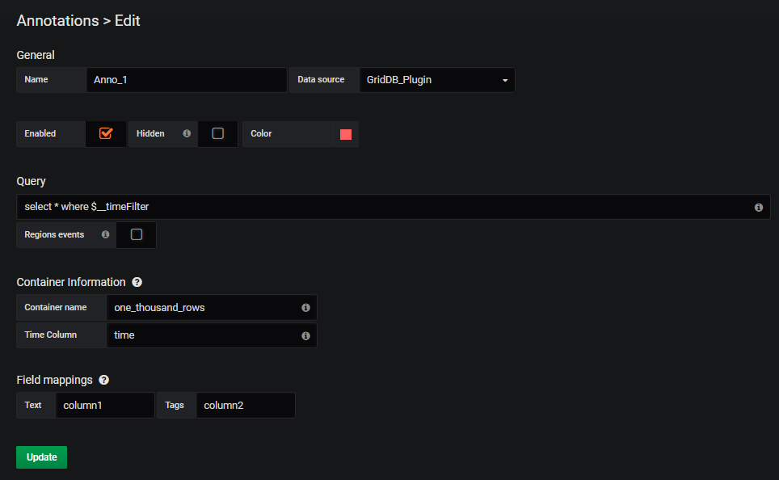

<span id="_Toc535842085" class="anchor"></span>Figure 11: Create a normal annotation

> <i>Note: Add “where $\_timeFilter” clause to limit the data inside the dashboard time range. Check appendix for more information about $\_timeFilter.</i>

**Step 5**: Click **Add** and **Save** to add a new annotation. After that, back to query data screen to check annotation.

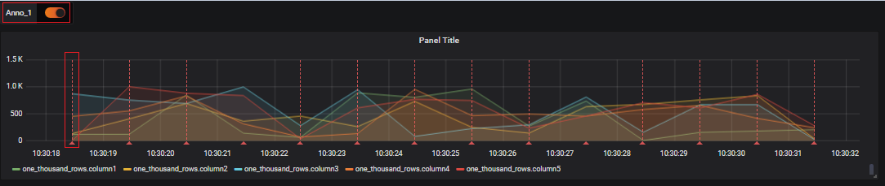

<span id="_Toc535842086" class="anchor"></span>Figure 12: Normal annotation on query data screen

Annotation name will be displayed on top of query data screen. The result of annotation display on the graph. Hover to annotation line to display information of annotation on a tooltip

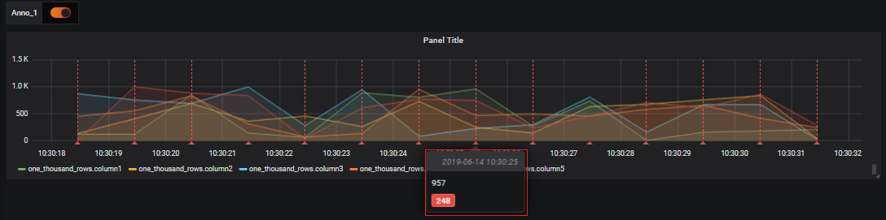

<span id="_Toc535842087" class="anchor"></span>Figure 13: Tooltip of annotation

**Step 6**: To create a **regions annotation**, let checked the regions events checkbox and input data below:

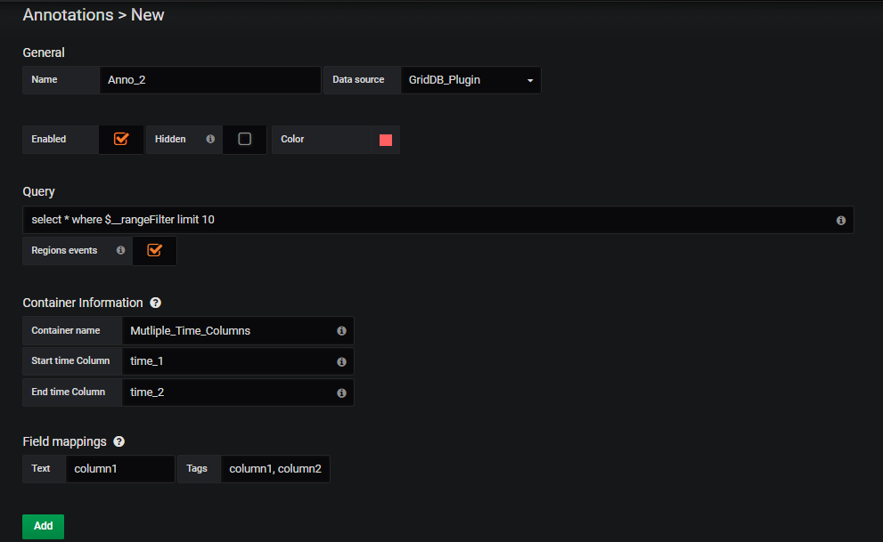

<span id="_Toc535842088" class="anchor"></span>Figure 14: Create regions annotation

> <i>Note: Regions annotation only support for a container has multiple time columns. Add “where $__rangeFilter” to limit the data inside the dashboard time range. Check appendix for more information about $__rangeFilter.</i>

**Step 7**: Click **Add** and **Save** to create new regions annotation. After that, back to query data screen to check annotation. Annotation name will be display on top of query data screen. Result of annotation display on graph

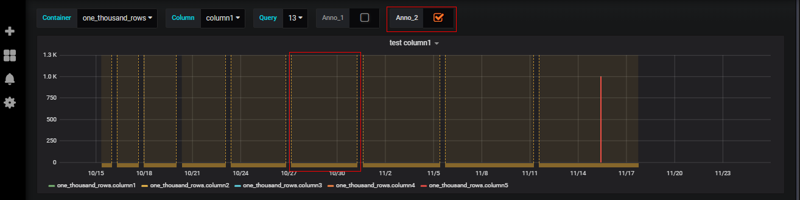

<span id="_Toc535842089" class="anchor"></span>Figure 15: Regions annotation display on query data screen

Hover to annotation line to display information of annotation on tooltip

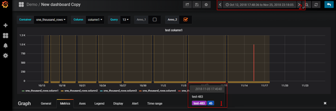

<span id="_Toc535842090" class="anchor"></span>Figure 16: Tooltip of regions annotation

| **Item** | **Description**                    |
| -------- | ---------------------------------- |
| 1        | Region annotation                  |
| 2        | This is the dash board time range. |

## Create query to draw Graph

### Precondition:

#### Variables list below: 

| **Variable name** | **Selected option** | **Description**                                          |
| ----------------- | ------------------- | -------------------------------------------------------- |
| Container         | one_thousand_rows   | Get container list in GridDB database                    |
| Column            | column1             | Get column list in one_thousand_rows container           |
| Query             | 13                  | Get all value of column1 in one_thousand_rows container  |


Select time range in UI. In actually, Grafana just display respond data which has time in selected time range so GridDB plugin auto add selected time range into TQL query to limit respond data. So graph just display when the user selects the appropriated time range.
    
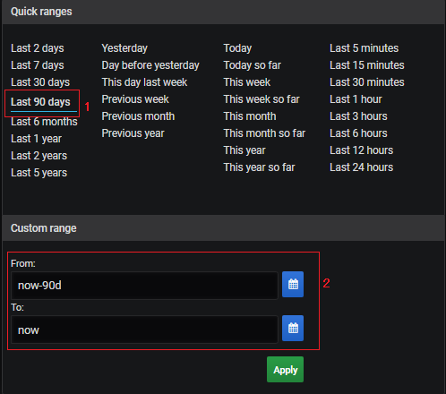

<span id="_Toc535595253" class="anchor"></span>Figure 17: Quick select time range

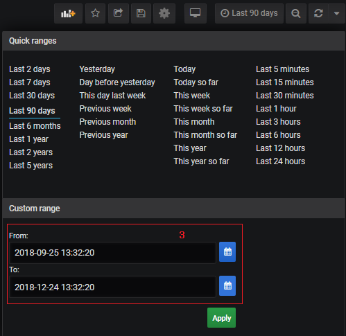

<span id="_Ref533414367" class="anchor"></span>Figure 18: Input time range

<table>
<thead>
<tr class="header">
<th><strong>Item</strong></th>
<th><strong>Description</strong></th>
</tr>
</thead>
<tbody>
<tr class="odd">
<td>1</td>
<td>Grafana provides some Quick ranges for a user. In this case chose Last 90 days.</td>
</tr>
<tr class="even">
<td>2</td>
<td><p>After selected Last 90 days, the value will auto change to:</p>
<p>From: now-90d</p>
<p>To: now</p>
</tr>
<tr class="even">
<td>3</td>
<td>Grafana provides input specific time by manual</td>
</tr>
</tbody>
</table>

### Create query

**Step 1**: Select GridDB datasource to show default GUI of create query function

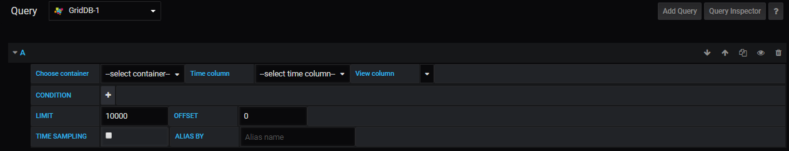

<span id="_Toc535595255" class="anchor"></span>Figure 19: Default GUI when create new query

**Step 2**: Select container, time column and list column to view data. “Choose container”, “Time column”, “View column” are default values.

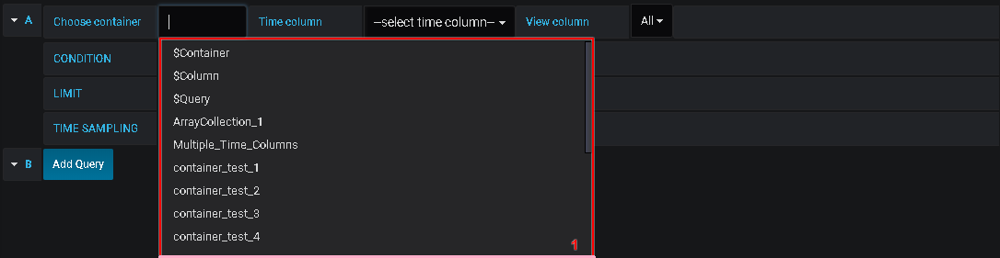

<span id="_Toc535595256" class="anchor"></span>Figure 20: List containers are displayed on container dropdown

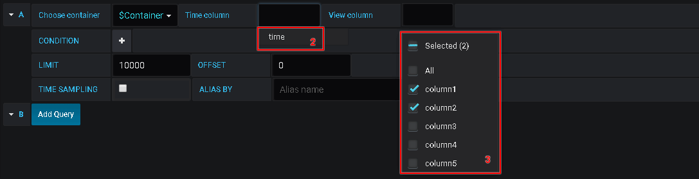

<span id="_Toc535595257" class="anchor"></span>Figure 21: View column of container are displayed on view dropdown

<table>
<thead>
<tr class="header">
<th><strong>Item</strong></th>
<th><strong>Description</strong></th>
</tr>
</thead>
<tbody>
<tr class="odd">
<td>1</td>
<td><p>List of all variable name and container name.</p>
<ul>
<li><p>In this case have 3 variables which have defined in pre-condition: All variable will be add ‘$’ at start: $Container, $Column, $Query. Although dropdown display all variable but just variable which select container list have meaning in this field.</p></li>
<li><p>After list variables will be list container name.</p></li>
</ul>
<p>In this example select ‘$Container’</p></td>
</tr>
<tr class="even">
<td>2</td>
<td><p>List of column which have type ‘TIMESTAMP’ in selected container.</p>
<p>In this case selected option of $Container is ‘one_thousand_rows’ so it will display all time column in ‘one_thousand_rows’ container, select ‘time’</p></td>
</tr>
<tr class="odd">
<td>3</td>
<td><p>List of all numeric column in selected container.</p>
<p>In this case is all numeric column in ‘one_thousand_rows’ container, select ‘column1’ and ‘column2’</p></td>
</tr>
</tbody>
</table>

After select ‘Choose container’, ‘Time column’, ‘View column’ Query panel as below picture.

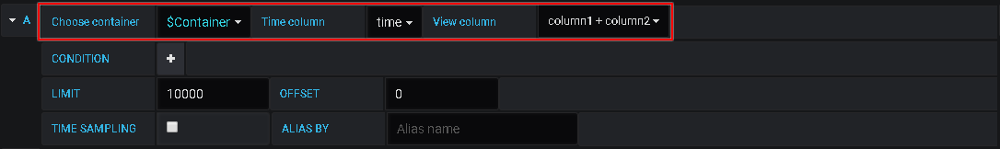

<span id="_Toc535595258" class="anchor"></span>Figure 22: Choose container, time column and view column for query

**Step 3**: Add one or more conditions for query

Click to Plus button to add condition. Item 1 in below picture is list in all suggest column in ‘one\_thousand\_rows’ container, select ‘column4’ option

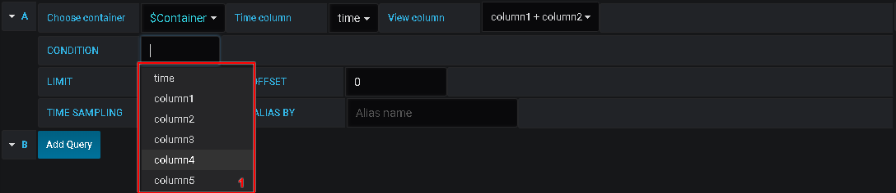

<span id="_Toc535595260" class="anchor"></span>Figure 23: List columns of container is suggested for condition

Item 2 in below picture is list of all supported operator, select ‘\>=’ operator.

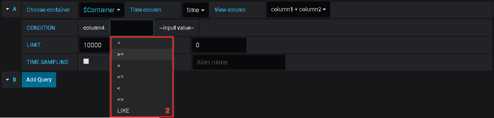

<span id="_Toc535595261" class="anchor"></span>Figure 24: List operators are displayed in compare dropdown

Item 3 in below picture is input field.

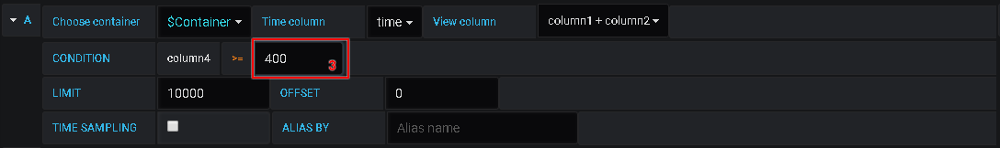

<span id="_Toc535595262" class="anchor"></span>Figure 25: Use enter value by manual for condition clause

To add more condition, click Plus button. In item in below picture, can input by manual variable name or column name. In this example, select ‘time’ column in dropdown as a key and input ‘$\_\_timeFrom’ as a value.

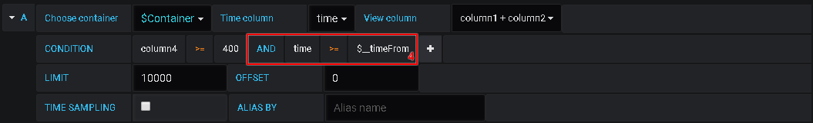

<span id="_Toc535595263" class="anchor"></span>Figure 26: User may be add more condition clause

Do same as previous step, all condition as item 5 in below picture.

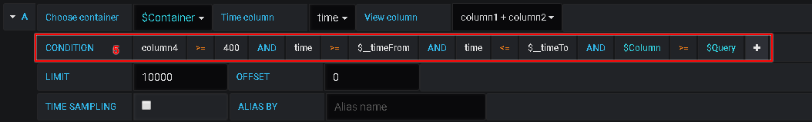

<span id="_Toc535595264" class="anchor"></span>Figure 27: Multiple conditions are added

After that Graph as below picture

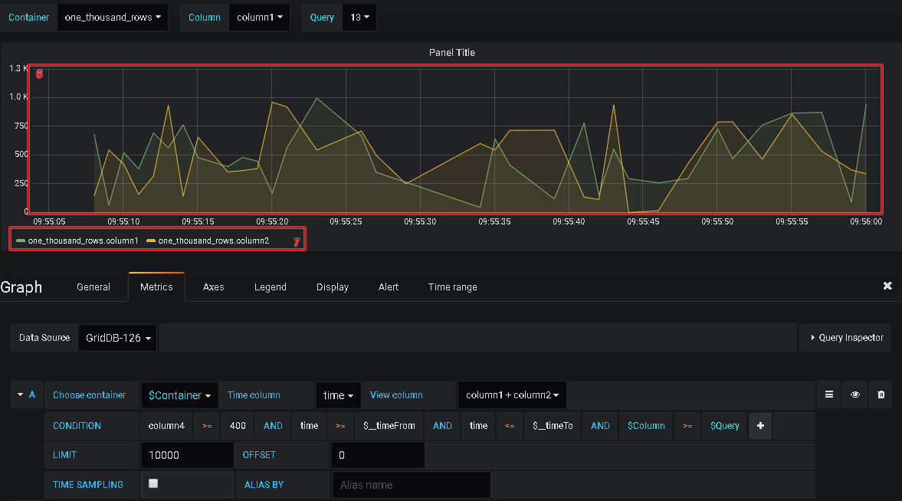

<span id="_Ref533432092" class="anchor"></span>Figure 28: Data is displayed on Graph

| **Item** | **Description**                                                                                              |
| -------- | ------------------------------------------------------------------------------------------------------------ |
| 6        | The Graph were draw by Grafana base on respond data. In this panel have 2 graph, one green, one yellow <br> <span>Line green: ‘one\_thousand\_rows.column1’ display data for column1</span><br><span>Line yellow: ‘one\_thousand\_rows.column2’ display data for column2</span>
| 7        | Graph legend                                                                                                 |

Grafana also support user to see the real query which were sent to server. Let take a look:

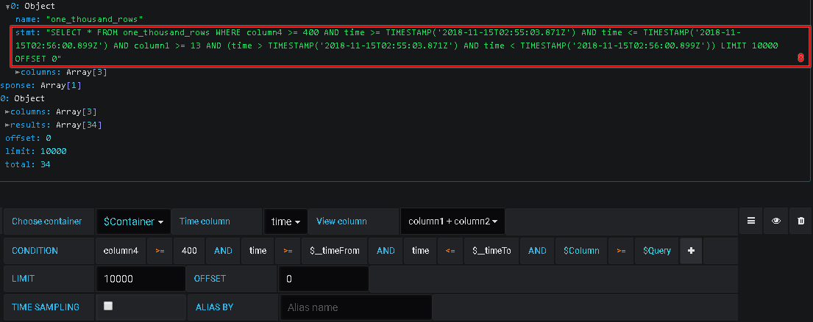

<span id="_Toc535595266" class="anchor"></span>Figure 29: Query inspector

With item 8, refer table below to explain query
<table>
<thead>
<tr class="header">
<th><strong>Select box query</strong></th>
<th><strong>Query inspector</strong></th>
</tr>
</thead>
<tbody>
<tr class="odd">
<td>$Container = one_thousand_rows</td>
<td>SELECT * FROM one_thousand_rows</td>
</tr>
<tr class="even">
<td>WHERE column4 &gt;= 400</td>
<td>WHERE column4 &gt;= 400</td>
</tr>
<tr class="odd">
<td>time &gt;= $__timeFrom
  <br>$__timeFrom = TIMESTAMP('2018-11-15T02:55:03.871Z')
</td>
<td>"time" &gt;= TIMESTAMP('2018-11-15T02:55:03.871Z')</td>
</tr>
<tr class="even">
<td>
time &lt;= $__timeFrom
<br>$__timeFrom = TIMESTAMP('2018-11-15T02:55:03.871Z')
</td>
<td>"time" &lt;= TIMESTAMP('2018-11-15T02:56:00.899Z')</td>
</tr>
<tr class="odd">
<td>
$Column = column1
<br>$Query = 13
<br>$Column &gt;= $Query
</td>
<td>column1 &gt;= 13 AND</td>
</tr>
<tr class="even">
<td>this item add into end of TQL query by automatically base on selected time range</td>
<td>(time &gt; TIMESTAMP('2018-11-15T02:55:03.871Z') AND time &lt; TIMESTAMP('2018-11-15T02:56:00.899Z'))</td>
</tr>
<tr class="odd">
<td>LIMIT 10000</td>
<td>LIMIT = 10000</td>
</tr>
<tr class="even">
<td>OFFSET 0</td>
<td>OFFSET = 0</td>
</tr>
</tbody>
</table>

> <i>Note: Check appendix for more information about “$” special expression.</i>

From Figure 30, User also limit respond records by specify value for Limit and change name for graph by define Alias

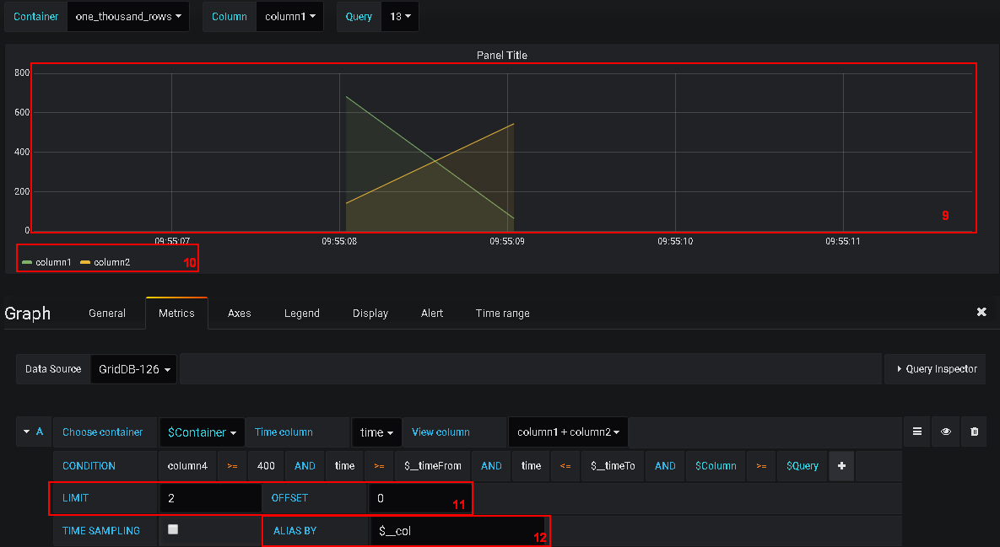

<span id="_Toc535595267" class="anchor"></span>Figure 30: Change alias of graph

| **Item** | **Description**                                                                                                 |
| -------- | --------------------------------------------------------------------------------------------------------------- |
| 9        | Both of graph green and yellow just have 2 points data                                                          |
| 11       | Update limit to 2                                                                                               |
| 12       | Update ALIAS BY to ‘$\_col’. After update item 11, 12, then item 9, 10 will be changed as above picture | 
| 10       | Legend change to ‘column1’ for green line and ‘column2’ for yellow line                                         |

From Figure 31, User also change to TIME\_SAMPLING by click to TIME_SAMPLING checkbox (item 14). The Graph will be changed as item 13:

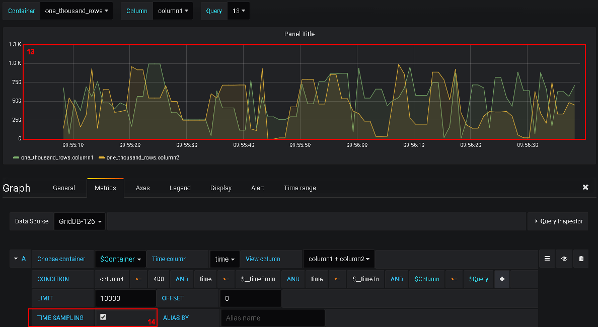

<span id="_Toc535595268" class="anchor"></span>Figure 31: Using timesampling in query

From Figure 32, User can change to Manual Input Mode by click into menu button after that select ‘Toggle Edit Mode’ as below picture

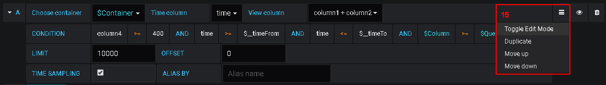

<span id="_Toc535595269" class="anchor"></span>Figure 32: Toggle edit mode

After that Manual Input Mode as below picture

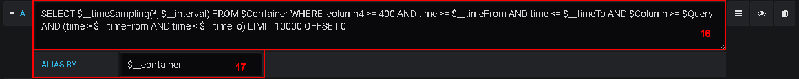

<span id="_Toc535595270" class="anchor"></span>Figure 33: Manual input mode

| **Item** | **Description**                                                                                                 |
| -------- | --------------------------------------------------------------------------------------------------------------- |
| 16       | GridDB Plugin will auto render from Select Box Mode                                                             |
| 17       | Update ALIAS BY into ‘$\_\_container’                                                                        |

After that Graph as below picture

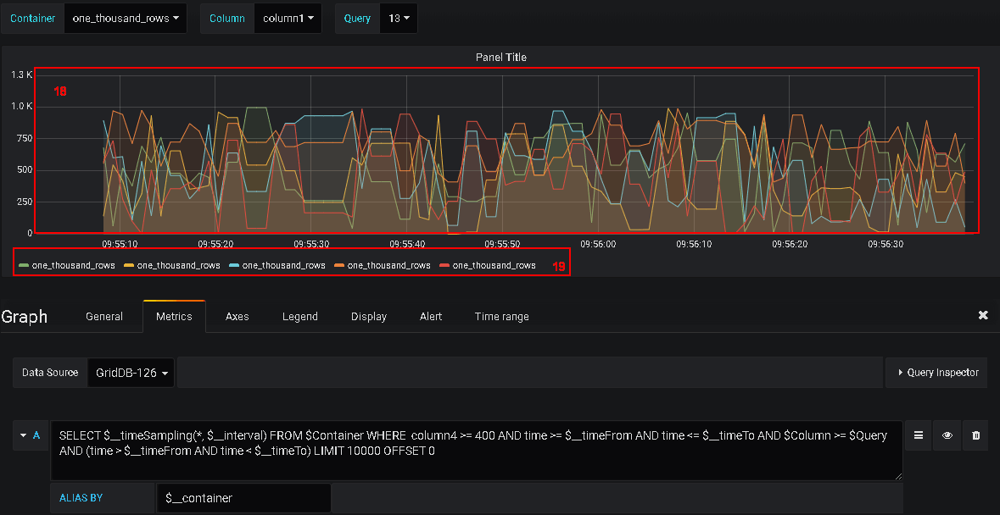

<span id="_Toc535595271" class="anchor"></span> Figure 34: Graph is displayed in manual input mode

| **Item** | **Description**                                                                                                 |
| -------- | --------------------------------------------------------------------------------------------------------------- |
| 18       | There are 5 graphs                                                                                           |
| 19       | Legend will be changed, name for all line graph in item 18 will be same is ‘one\_thousand\_rows’                |

It will look into real query send to server

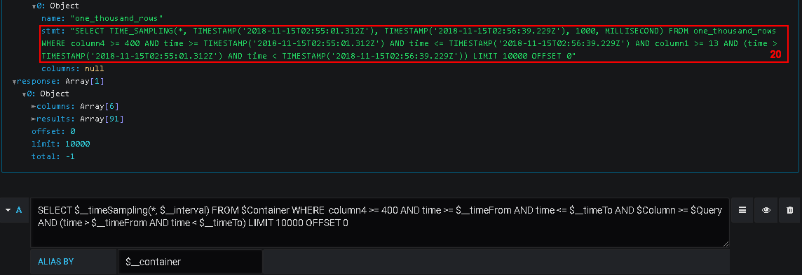

<span id="_Toc535595272" class="anchor"></span>Figure 35: Query inspector
                                                                              
<table>
<thead>
<tr class="header">
<th><strong>Item 20</strong></th>
<th><strong>Explanation</strong></th>
</tr>
</thead>
<tbody>
<tr class="odd">
<td>$__timeSampling(*, $__interval)</td>
<td><p>Replace with:</p>
<p>TIME_SAMPLING(*, TIMESTAMP('2018-11-15T02:55:01.312Z'), TIMESTAMP('2018-11-15T02:56:39.229Z'), 1000, MILLISECOND)</p></td>
</tr>
</tbody>
</table>

> <i>Note: Check appendix for more information about “$” special expression.</i>

## Create Query With Explore
**Start Exploring**

There are two method to open Explore:
<ul>
<li><p>Method 1:</p></li>
</ul>
Open new Explore icon on the menu bar to the left.

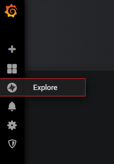

<span id="_Toc535595273" class="anchor"></span>Figure 36: Open Explore on menu bar

<ul>
<li><p>Method 2:</p></li>
</ul>
Open new Explore tab with the query from the panel.

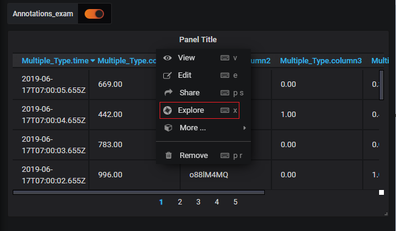

<span id="_Toc535595274" class="anchor"></span>Figure 37: Open Explore from the panel
                                                                                  
**The interface of Explore Grafana**

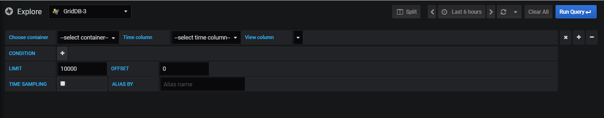
<span id="_Toc535595275" class="anchor"></span>Figure 38: The interface of Explore Grafana

**Query data of Explore**

Please refer to [Create query to draw Graph](#create-query-to-draw-graph)

**Other feature of Explore**

1. Create/add/delete query in explore:

There are three buttons beside the query field, a clear button (X), an add query button (+) and the remove query button (-).

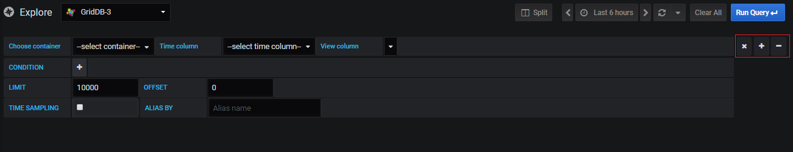
<span id="_Toc535595276" class="anchor"></span>Figure 39: Create/add/delete query in explore

1. Split and Compare:

The Split feature is an easy way to compare graphs and tables side-by-side or to look at related data together on one page. Click the split button to duplicate the current query and split the page into two side-by-side queries. 

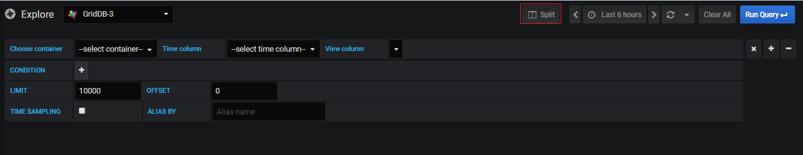
<span id="_Toc535595276" class="anchor"></span>Figure 40: Open split in explore

Allows you to compare the same query for two different servers or to compare the staging environment to the production environment.

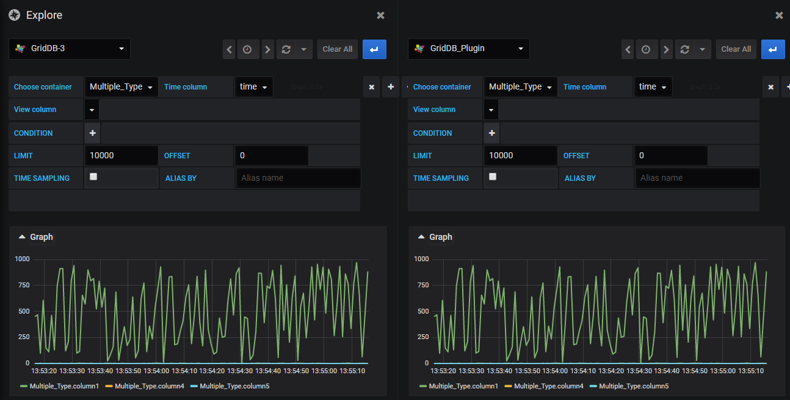
<span id="_Toc535595276" class="anchor"></span>Figure 41: Compare two query the same 

# Appendix

## Query special expression

The following expression can be used in query input to create dynamic query.

<table>
<thead>
<tr class="header">
<th><strong>Name</strong></th>
<th><strong>Description</strong></th>
</tr>
</thead>
<tbody>
<tr class="odd">
<td colspan="2"><b>Special variables: The follow syntax will be replace by a special value define by GridDB Plugin.</b></td>
</tr>
<tr class="even">
<td>$__timeFrom</td>
<td><p>The start of the current time range of Dash board.</p>
<p>Replace with below:</p>
<p>TIMESTAMP({Dash board start time})</p>
<p><em>*Note: The current time range is in the top right corner of the dash board.</em></p></td>
</tr>
<tr class="odd">
<td>$__timeTo</td>
<td><p>The end of the current time range of Dash board.</p>
<p>Replace with below:</p>
<p>TIMESTAMP({Dash board end time})</p>
<p><em>*Note: The current time range is in the top right corner of the dash board.</em></p></td>
</tr>
<tr class="even">
<td>$__col</td>
<td>Use in Alias patterns. It will be replaced with the specified column name</td>
</tr>
<tr class="odd">
<td>$__container</td>
<td>Use in Alias patterns. It will be replaced with the specified container name</td>
</tr>
<tr class="even">
<td>$__interval</td>
<td><p>This variable only used in $__timeSampling macro.</p>
<p>Value of this variable will scale with the dash board time range.</p>
<p>Example:</p>
<p>when the dashboard show data in 1 year, $__interval = 1 day</p>
<p>when the dashboard show data in 1 day, $__interval = 1 minute</p>
<p>Lower limit of this variable is specified by $__minInterval variable.</p>
<p>When use in query it will be replace with Grafana time interval notion.</p>
<p><em>*Note: Grafana interval time is a special auto option that will change depending on the current time range in the top right corner of the dash board.</em></p></td>
</tr>
<tr class="odd">
<td>$__minInterval</td>
<td>Lower limit of $__interval variable. Defined in Create Data Source screen.</td>
</tr>
<tr class="even">
<td colspan="2"><b>Variables: The follow syntax will be replace by value of a custom variable define by user.</b></td>
</tr>
<tr class="odd">
<td>${variable name}</td>
<td>Replace with current variable value.</td>
</tr>
<tr class="even">
<td>Macro: The follow syntax will be replace by a TQL expression.</td>
<td></td>
</tr>
<tr class="odd">
<td>$__timeFilter</td>
<td><p>Use to limit data.</p>
<p>Replace with below condition:</p>
<p>{time column} &gt; $__timeFrom AND {time column} &lt; $__timeTo</p></td>
</tr>
<tr class="even">
<td>$__rangeFilter</td>
<td><p>Use to limit regions annotation data.</p>
<p>Only use in regions annotation. Replace with below condition:</p>
<p>({start time column} &gt; $__timeFrom AND {start time column} &lt; $__timeTo) OR</p>
<p>({end time column} &gt; $__timeFrom AND {end time column} &lt; $__timeTo)</p></td>
</tr>
<tr class="odd">
<td>$__timeSampling({column name}, {time interval})</td>
<td><p>Replace with below expression:</p>
<p>TIME_SAMPLING ({column name}, $__timeFrom, $__timeTo, {time interval value}, {time interval unit})</p>
<p>The input {time interval} follow Grafana time interval notion:</p></td>
</tr>
</tbody>
</table>

Below show the possible usage of special expression in query input scenario.

<table>
<thead>
<tr class="header">
<th>Expression</th>
<th>Query data</th>
<th>Query data - alias</th>
<th>Query annotation data</th>
</tr>
</thead>
<tbody>
<tr class="odd">
<td>$__timeFilter</td>
<td>-</td>
<td>-</td>
<td>x (*)</td>
</tr>
<tr class="even">
<td>$__rangeFilter</td>
<td>-</td>
<td>-</td>
<td>x (**)</td>
</tr>
<tr class="odd">
<td>$__timeSampling({column name}, {time interval})</td>
<td>x</td>
<td>-</td>
<td>x</td>
</tr>
<tr class="even">
<td>$__interval</td>
<td>x</td>
<td>-</td>
<td>x</td>
</tr>
<tr class="odd">
<td>$__minInterval</td>
<td>x</td>
<td>-</td>
<td>x</td>
</tr>
<tr class="even">
<td>$__timeFrom</td>
<td>x</td>
<td>-</td>
<td>x</td>
</tr>
<tr class="odd">
<td>$__timeTo</td>
<td>x</td>
<td>-</td>
<td>x</td>
</tr>
<tr class="even">
<td>$__col</td>
<td>-</td>
<td>x</td>
<td>-</td>
</tr>
<tr class="odd">
<td>$__container</td>
<td>-</td>
<td>x</td>
<td>-</td>
</tr>
<tr class="even">
<td><p>Variables are created by user:</p>
<p>/^${variable name}$/</p></td>
<td>x</td>
<td>-</td>
<td>-</td>
</tr>
</tbody>
</table>

> <i> Note:
<br> (*) Use in case query single annotation. Should always use this expression to limit data.
<br> (**) Use in case query range annotation. Should always use this expression to limit data.
</i>